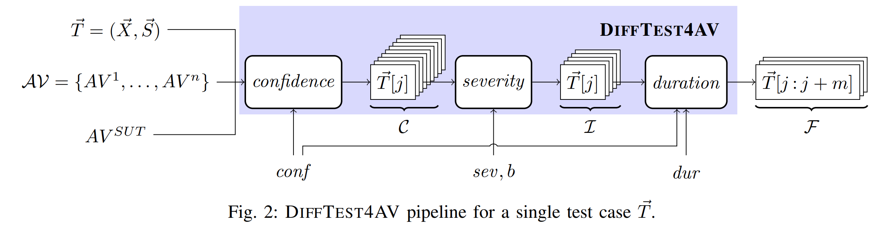

# A Differential Testing Framework to Identify Critical AV Failures Leveraging Arbitrary Inputs



This repository contains the code for the ICSE'25 submission "A Differential Testing Framework to Identify Critical AV Failures Leveraging Arbitrary Inputs"

Due to liscensing limitations, the videos utilized in the experiment cannot be bundled with the anonymized repository. However, the AV and SUT outputs produced from the videos have been included.

# Repository Structure
Folder Structure:
* [0_Setup](/0_Setup) - Information on setting up and running the SUTs used in the experiment
* [1_Datasets](/1_Datasets) - Placeholder for datasets - ommitted for anonymization.
* [2_TransformVideos](/2_TransformVideos) - Scripts to normalize data in `1_Datasets`
* :star: [3_Process](/3_Process) - Scripts to execute the experiment
  * :clipboard: [cache](/3_Process/cache) - Raw performance data from the SUTs evaluated on all videos.
  * :toolbox: :star2: [OutlierDetection.py](/3_Process/OutlierDetection.py) - Code to perform the statistical analysis of DiffTest4AV. This implementation uses the Dixon's Q test for outlier detection (`dixon`).

# Reproducing the results in the paper
The following was tested on a fresh install of Ubuntu 22.04 using [miniconda](https://docs.conda.io/projects/conda/en/latest/user-guide/install/linux.html)

With `conda` installed, run the following:

```bash
source create_env.sh
source generate_figures.sh
```

This will launch all of the scripts in succession to compute all of the figures and tables used in the paper. The scripts are heavily parallelized and will run for ~20 minutes on a machine with 32 cores; runtimes will vary based on available hardware.

All figures will be saved in [3_Process/gen_figures/](3_Process/gen_figures). A version of these figures has been bundled with this repository; running the script will overwrite the included files.

The following table describes how to find the figures used in the paper.
NOTE: all referenced frames from the paper, e.g. Figures 1, 3, 4, 5, 6, and 9 will appear as a blank image with steering angles only since the videos are not included.


| Paper Figure | Generated file |
|-------|--------|
| Fig 1.| [image link](3_Process/gen_figures/referenced_examples/sut4/External_Jutah/cache/011_Chicago_Billionaires_Millionaires_Lake_Shore_Mansions_The_North_Shore_15/011_Chicago_Billionaires_Millionaires_Lake_Shore_Mansions_The_North_Shore_15_frame3465.png) |
| Fig 3.| [image link](3_Process/gen_figures/referenced_examples/sut4/OpenPilot_2k19/cache/video_0320_15/video_0320_15_frame404.png) |
| Table 1| [table link](3_Process/gen_figures/referenced_examples/sut4/OpenPilot_2k19/cache/video_0320_15/output_404.txt) |
| Fig 4.| [image link](3_Process/gen_figures/referenced_examples/sut4/OpenPilot_2k19/cache/video_0869_15/video_0869_15_frame222.png) |
| Table 2| [table link](3_Process/gen_figures/referenced_examples/sut4/OpenPilot_2k19/cache/video_0869_15/output_222.txt) |
| Fig 5.| [image link](3_Process/gen_figures/referenced_examples/sut4/OpenPilot_2k19/cache/video_0171_15/video_0171_15_frame252.png) |
| Fig 6.| [image link](3_Process/gen_figures/referenced_examples/sut4/OpenPilot_2k19/cache/video_0284_15/video_0284_15_frame190.png) |
| Fig 7.| [image link](3_Process/gen_figures/conf_cdf.png) |
| Fig 8a.| [image link](3_Process/gen_figures/OpenPilot_2016_conf_vs_value_hist_sut_2023_06_90__5line.png) |
| Fig 8b.| [image link](3_Process/gen_figures/OpenPilot_2k19_conf_vs_value_hist_sut_2023_06_90__5line.png) |
| Fig 8c.| [image link](3_Process/gen_figures/External_Jutah_conf_vs_value_hist_sut_2023_06_90__5line.png) |
| Table V | [table link](3_Process/gen_figures/table5.txt) |
| Fig 9a.| [image link](3_Process/gen_figures/referenced_examples/sut4/External_Jutah/cache/011_Chicago_Billionaires_Millionaires_Lake_Shore_Mansions_The_North_Shore_15/011_Chicago_Billionaires_Millionaires_Lake_Shore_Mansions_The_North_Shore_15_frame3465.png) |
| Fig 9b.| [image link](3_Process/gen_figures/referenced_examples/sut4/External_Jutah/cache/011_Chicago_Billionaires_Millionaires_Lake_Shore_Mansions_The_North_Shore_15/011_Chicago_Billionaires_Millionaires_Lake_Shore_Mansions_The_North_Shore_15_frame3466.png) |
| Fig 9c.| [image link](3_Process/gen_figures/referenced_examples/sut4/External_Jutah/cache/011_Chicago_Billionaires_Millionaires_Lake_Shore_Mansions_The_North_Shore_15/011_Chicago_Billionaires_Millionaires_Lake_Shore_Mansions_The_North_Shore_15_frame3467.png) |
| Fig 9d.| [image link](3_Process/gen_figures/referenced_examples/sut4/External_Jutah/cache/011_Chicago_Billionaires_Millionaires_Lake_Shore_Mansions_The_North_Shore_15/011_Chicago_Billionaires_Millionaires_Lake_Shore_Mansions_The_North_Shore_15_frame3468.png) |
| Fig 9e.| [image link](3_Process/gen_figures/referenced_examples/sut4/External_Jutah/cache/011_Chicago_Billionaires_Millionaires_Lake_Shore_Mansions_The_North_Shore_15/011_Chicago_Billionaires_Millionaires_Lake_Shore_Mansions_The_North_Shore_15_frame3469.png) |
| Table VI | [table link](3_Process/gen_figures/table6.txt) |
